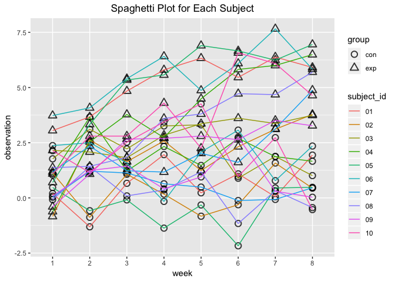

p8105\_hw5\_jz3036
================
Junyuan Zheng (jz3036)
2018-11-04

-   Import necessary packages.

``` r
library(tidyverse)
```

    ## ── Attaching packages ─────────────────────────────────────────────────────────── tidyverse 1.2.1 ──

    ## ✔ ggplot2 3.0.0     ✔ purrr   0.2.5
    ## ✔ tibble  1.4.2     ✔ dplyr   0.7.6
    ## ✔ tidyr   0.8.1     ✔ stringr 1.3.1
    ## ✔ readr   1.1.1     ✔ forcats 0.3.0

    ## ── Conflicts ────────────────────────────────────────────────────────────── tidyverse_conflicts() ──
    ## ✖ dplyr::filter() masks stats::filter()
    ## ✖ dplyr::lag()    masks stats::lag()

``` r
#library(readxl)
```

Problem 1
=========

-   Start with a dataframe containing all file names.

``` r
file_names = list.files(path = './data') %>%
  tibble('subject' = .)
head(file_names) %>% 
  knitr::kable() 
```

| subject     |
|:------------|
| con\_01.csv |
| con\_02.csv |
| con\_03.csv |
| con\_04.csv |
| con\_05.csv |
| con\_06.csv |

-   Iterate over file names and read in data for each subject using purrr::map and saving the result as a new variable in the dataframe.

``` r
data = 
  file_names %>% 
  mutate(., path = paste('./data/', subject, sep='')) %>% 
  mutate(., arm_data = map(.x = path, ~read_csv(file = .x)))
head(data) %>% 
  knitr::kable() 
```

| subject     | path               | arm\_data                                                                                                                                 |
|:------------|:-------------------|:------------------------------------------------------------------------------------------------------------------------------------------|
| con\_01.csv | ./data/con\_01.csv | list(week\_1 = 0.2, week\_2 = -1.31, week\_3 = 0.66, week\_4 = 1.96, week\_5 = 0.23, week\_6 = 1.09, week\_7 = 0.05, week\_8 = 1.94)      |
| con\_02.csv | ./data/con\_02.csv | list(week\_1 = 1.13, week\_2 = -0.88, week\_3 = 1.07, week\_4 = 0.17, week\_5 = -0.83, week\_6 = -0.31, week\_7 = 1.58, week\_8 = 0.44)   |
| con\_03.csv | ./data/con\_03.csv | list(week\_1 = 1.77, week\_2 = 3.11, week\_3 = 2.22, week\_4 = 3.26, week\_5 = 3.31, week\_6 = 0.89, week\_7 = 1.88, week\_8 = 1.01)      |
| con\_04.csv | ./data/con\_04.csv | list(week\_1 = 1.04, week\_2 = 3.66, week\_3 = 1.22, week\_4 = 2.33, week\_5 = 1.47, week\_6 = 2.7, week\_7 = 1.87, week\_8 = 1.66)       |
| con\_05.csv | ./data/con\_05.csv | list(week\_1 = 0.47, week\_2 = -0.58, week\_3 = -0.09, week\_4 = -1.37, week\_5 = -0.32, week\_6 = -2.17, week\_7 = 0.45, week\_8 = 0.48) |
| con\_06.csv | ./data/con\_06.csv | list(week\_1 = 2.37, week\_2 = 2.5, week\_3 = 1.59, week\_4 = -0.16, week\_5 = 2.08, week\_6 = 3.07, week\_7 = 0.78, week\_8 = 2.35)      |

-   Tidy the result; manipulate file names to include control arm and subject ID, make sure weekly observations are “tidy”, and do any other tidying that’s necessary.

``` r
tidy_data = 
  select(data, subject, arm_data) %>% 
  unnest(.,) %>%
  mutate(., subject = str_replace(subject, '.csv', '')) %>% 
  separate(., subject, into = c('group','subject_id'), sep = '_') %>% 
  gather(., key = week, value = observation, week_1:week_8) %>% 
  mutate(., week = str_replace(week, 'week_', ''))
head(tidy_data) %>% 
  knitr::kable() 
```

| group | subject\_id | week |  observation|
|:------|:------------|:-----|------------:|
| con   | 01          | 1    |         0.20|
| con   | 02          | 1    |         1.13|
| con   | 03          | 1    |         1.77|
| con   | 04          | 1    |         1.04|
| con   | 05          | 1    |         0.47|
| con   | 06          | 1    |         2.37|

-   Make a spaghetti plot showing observations on each subject over time, and comment on differences between groups.

``` r
tidy_data %>% 
  ggplot(., aes(x = week, y = observation, group=interaction(group, subject_id), color = subject_id, shape = group)) +
  geom_point(color = 'black', size = 3, alpha = 0.8, stroke = 1) +
  scale_shape_manual(values=c(1,2)) +
  geom_line() +
  labs(title = 'Spaghetti Plot for Each Subject') +
  theme(plot.title = element_text(hjust = 0.5))
```

 As shown by the spaghetti plot above, the experimental group (triangle) is generally higher than the control group (circle) on observation across these 8 weeks.

Problem 2
=========

``` r
data_p2 = 
  read_csv(file='./homicide_data/homicide-data.csv')
```

-   Describe the raw data. Create a city\_state variable (e.g. “Baltimore, MD”) and then summarize within cities to obtain the total number of homicides and the number of unsolved homicides (those for which the disposition is “Closed without arrest” or “Open/No arrest”).

This is a dataset collected by Washington Post regarding criminal homicide over the past years in 50 America cities.The raw data contains 52179 rows/observations, and 12 columns/variables. Variables mainly includes the victims' personal info such as name, race and sex, as well as the location info of the cases, including city, state and coordinates.

``` r
data_p2_city =  
  mutate(data_p2, city_state = paste(city, state, sep = ', ')) %>% 
  group_by(., city_state) %>% 
  summarize(., case_number = n(),
               case_unsolved = 
               sum(disposition == 'Closed without arrest' | disposition == 'Open/No arrest'))
data_p2_city
```

    ## # A tibble: 51 x 3
    ##    city_state      case_number case_unsolved
    ##    <chr>                 <int>         <int>
    ##  1 Albuquerque, NM         378           146
    ##  2 Atlanta, GA             973           373
    ##  3 Baltimore, MD          2827          1825
    ##  4 Baton Rouge, LA         424           196
    ##  5 Birmingham, AL          800           347
    ##  6 Boston, MA              614           310
    ##  7 Buffalo, NY             521           319
    ##  8 Charlotte, NC           687           206
    ##  9 Chicago, IL            5535          4073
    ## 10 Cincinnati, OH          694           309
    ## # ... with 41 more rows

-   For the city of Baltimore, MD, use the prop.test function to estimate the proportion of homicides that are unsolved; save the output of prop.test as an R object, apply the broom::tidy to this object and pull the estimated proportion and confidence intervals from the resulting tidy dataframe.

``` r
propt_baltimore = prop.test(1825, 2827, p = 0.5)
propt_baltimore_tidy = broom::tidy(propt_baltimore)
```

The estimated proportion is 0.6455607. The CI is between 0.6275625 and 0.6631599.

-   Now run prop.test for each of the cities in your dataset, and extract both the proportion of unsolved homicides and the confidence interval for each. Do this within a “tidy” pipeline, making use of purrr::map, purrr::map2, list columns and unnest as necessary to create a tidy dataframe with estimated proportions and CIs for each city.

``` r
city_prop_test = 
  mutate(data_p2_city, prop_test = map2(.x = case_number, .y = case_unsolved,
                             ~prop.test(.y, .x) %>% broom::tidy())) %>%
  unnest() %>% 
  select(., city_state, case_number, case_unsolved, estimate, conf.low, conf.high)
```

    ## Warning in prop.test(.y, .x): Chi-squared approximation may be incorrect

``` r
city_prop_test
```

    ## # A tibble: 51 x 6
    ##    city_state      case_number case_unsolved estimate conf.low conf.high
    ##    <chr>                 <int>         <int>    <dbl>    <dbl>     <dbl>
    ##  1 Albuquerque, NM         378           146    0.386    0.337     0.438
    ##  2 Atlanta, GA             973           373    0.383    0.353     0.415
    ##  3 Baltimore, MD          2827          1825    0.646    0.628     0.663
    ##  4 Baton Rouge, LA         424           196    0.462    0.414     0.511
    ##  5 Birmingham, AL          800           347    0.434    0.399     0.469
    ##  6 Boston, MA              614           310    0.505    0.465     0.545
    ##  7 Buffalo, NY             521           319    0.612    0.569     0.654
    ##  8 Charlotte, NC           687           206    0.300    0.266     0.336
    ##  9 Chicago, IL            5535          4073    0.736    0.724     0.747
    ## 10 Cincinnati, OH          694           309    0.445    0.408     0.483
    ## # ... with 41 more rows
